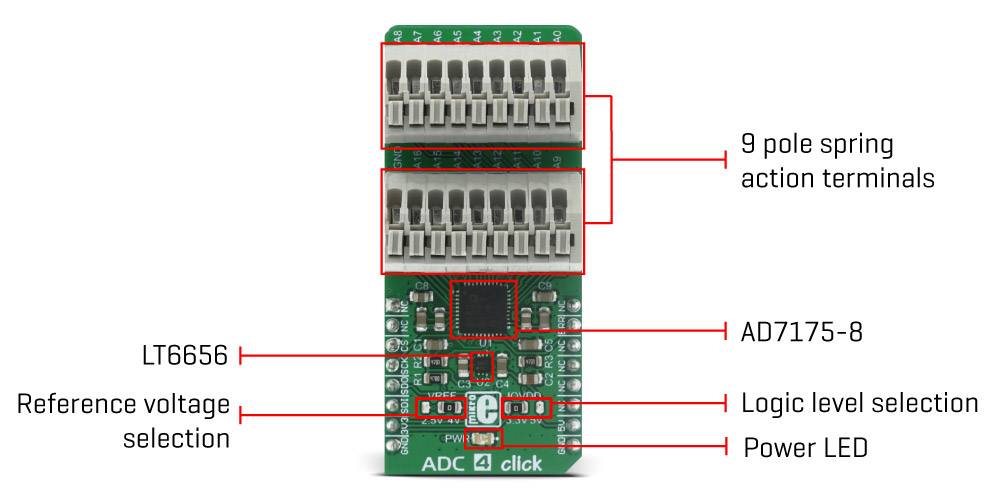

**ADC 4 click** is an advanced analog to digital multichannel converter, which can sample inputs from 16 single-ended channels or 8 differential input channel pairs. This device has a quite high sampling resolution of 24 bits and the output data rates can range from 5 SPS to 250 kSPS. Besides the internal 2.5V reference voltage source, ADC 4 click is also equipped with an external reference voltage circuit, which provides 4.096V. Finally, a custom reference voltage - up to 5V can be connected to the multiplexed inputs of the ADC converter. These options give a lot of flexibility in choosing the right reference voltage for any application.

Along with the two 9 pole spring action terminals that provide easy and secure connection to the input channels, this device has many other outstanding features, which make it a perfect choice for an accurate and simple digitalisation of analog signals from various sensors in PLC/DCS modules, temperature and pressure measurement, medical and scientific instrumentation, chromatography and other similar applications, where accurate analog to digital conversion is needed.

